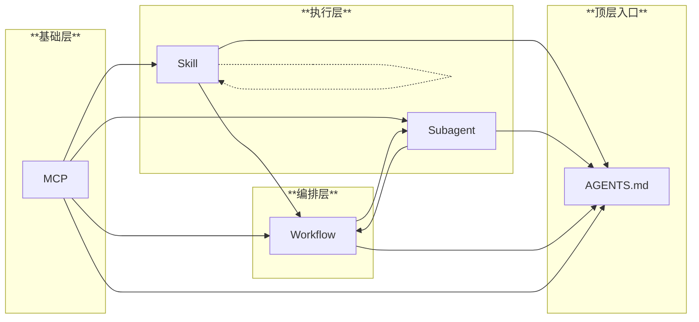

# AGENTS.md

本文件为围绕 mcp, skill, subagent, 主 agent, workflow 生态的 vibe 架构，专门面向科研人员

---

## 架构层级

**依赖规则**：
- **单向依赖**：低层不依赖高层（MCP 不知道 skill，skill 不知道 workflow）
- **Skill 内引用**：Skill 可调用其他 skill，但禁止循环依赖
- **Workflow 特殊性**：Workflow 可被 subagent 调用（执行预设流程），但 workflow 间不能互调用
- **AGENTS.md**：纯入口文件，做路由索引

---

## 关联项目简介

<!-- TODO: 请填写你的项目简介 -->
<!-- 例如：本项目是 XXX，主要研究 YYY... -->

---

## 核心原则

1) **遵循固有workflow**
   - 根据用户提问进入到不同类型的预设workflow执行工作

2) **节省主窗口上下文**
   - 必要时根据场景委派 subagent 独立处理复杂信息，返回精炼结构化结果

3) **减轻认知负载 + 循环反馈**
   - 明确用户角色为"科研人员"，不是全知全能
   - 确认颗粒度：**里程碑和意图**，而非工程细节
   - 用户未明确说"结束"前，保持反馈循环(调用`mcp_interactive_feedback`)
   - 具体反馈策略（频率、时机、内容）由各 workflow 定义，避免过度打扰
   - 用户主动询问工程实现时，才深入技术细节，用通俗易懂的语言解释

---

## Subagent 路由与委派

主 agent 主要负责回答用户问题/coding；只有在"需要把工作拆给更合适的子 agent"时才委派（`RunSubagent` + 准确的 agent 名称 + 详细问题）。主 agent 只负责 **when（何时委派）** 和 **what（问题描述）**， 子 agent 的 **how（内部怎么做）** 自有说明。各 subagent 的委派条件和输入格式见其 description。

---

## Workflow

预设的典型作业流程，覆盖用户的全部提问场景。Workflow 是**活的**：
- **自身不死板**：阶段不必严格线性执行，可根据实际情况灵活切换
- **之间可切换**：根据问题和对话演进，可从一个 workflow 切换到另一个

| 名称 | 适用场景 | 路径 |
|------|----------|------|
| 科研idea助理 | 提出科研想法，从抽象概念到具体实现 | `.github/workflows/idea-assistant.md` |
| 问题咨询 | 提问、概念解释、代码解读 | `.github/workflows/question-consult.md` |
| 代码调试 | 运行错误、训练异常、性能问题 | `.github/workflows/code-debug.md` |
| 工程构建 | 环境配置、依赖安装、CI/CD | `.github/workflows/engineering.md` |

---

## 反馈交互

- 分清**反馈窗口**和**对话窗口**两个概念
- **反馈窗口**：`mcp_interactive_feedback` 工具弹出的专门反馈交互界面
- **对话窗口**：主 agent 工作的主要交互界面
- 不存在 `mcp_interactive_feedback` 类似工具调用时，直接在对话窗口中进行反馈