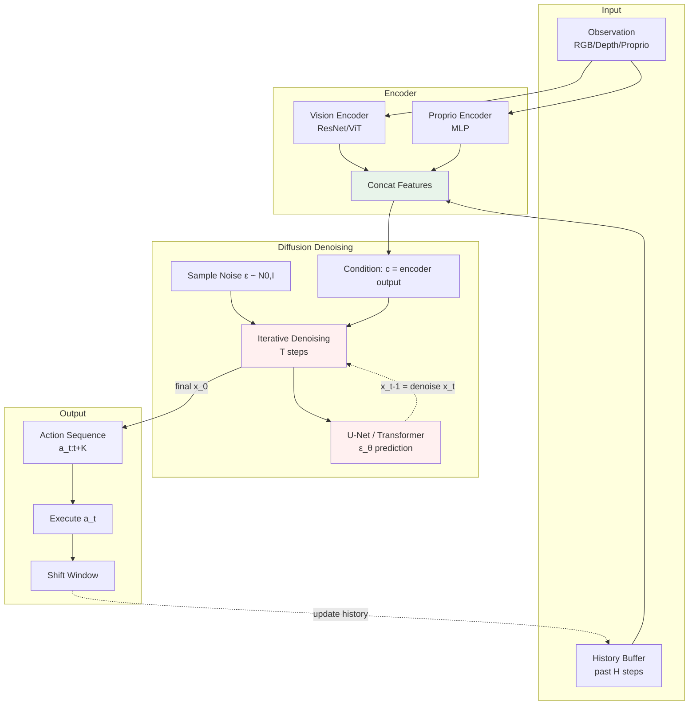

```mermaid
graph TD
  subgraph Input
      I1[Observation<br/>RGB/Depth/Proprio]
      I2[History Buffer<br/>past H steps]
  end
  
  subgraph Encoder
      EN1[Vision Encoder<br/>ResNet/ViT]
      EN2[Proprio Encoder<br/>MLP]
      EN3[Concat Features]
  end
  
  subgraph Diffusion Denoising
      D1[Sample Noise ε ~ N0,I]
      D2[Condition: c = encoder output]
      D3[Iterative Denoising<br/>T steps]
      D4[U-Net / Transformer<br/>ε_θ prediction]
  end
  
  subgraph Output
      O1[Action Sequence<br/>a_t:t+K]
      O2[Execute a_t]
      O3[Shift Window]
  end
  
  I1 --> EN1
  I1 --> EN2
  I2 --> EN3
  EN1 --> EN3
  EN2 --> EN3
  EN3 --> D2
  D1 --> D3
  D2 --> D3
  D3 --> D4
  D4 -.->|x_t-1 = denoise x_t| D3
  D3 -->|final x_0| O1
  O1 --> O2
  O2 --> O3
  O3 -.->|update history| I2
  
  style EN3 fill:#e8f4ea
  style D3 fill:#fff0f0
  style D4 fill:#fff0f0
  style O1 fill:#f0f0ff
```