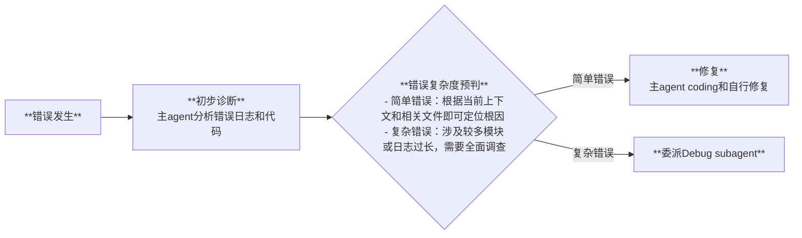

# 代码调试 Workflow

**适用场景**：运行错误、训练异常、性能问题等场景，需要修改已有代码以修复问题

---

## 流程图

---

## 阶段说明

| 阶段 | 执行者 | 关键动作 |
|------|--------|----------|
| **初步诊断** | 主 agent | 分析错误日志、定位相关代码 |
| **复杂度预判** | 主 agent | 判断错误涉及范围，决定自行修复或委派 |
| **修复** | 主 agent 或 debug subagent | 定位根因 + coding 修复 + 验证 |

---

## 委派条件

**简单错误**（主 agent 自行修复）：
- 错误信息明确指向单一位置
- 根据当前上下文和相关文件即可定位根因
- 修复范围有限

**复杂错误**（委派 Debug subagent）：
- 涉及多个模块交互
- 日志过长需要全面调查
- 需要在临时分支中实验性修复

---

## 反馈策略

- **初步诊断**完成后可在反馈窗口汇报发现
- 进入**修复**阶段后，主 agent / subagent 端到端执行，少做工程细节反馈
- 仅遇到影响系统环境和实现结果等重大决策分支才请求用户反馈

---

## 认知负担管理

用户参与度**低**：
- 用户只需提供错误信息/日志
- 修复过程尽量自动化
- 仅关键决策点请求确认，用通俗语言说明情况