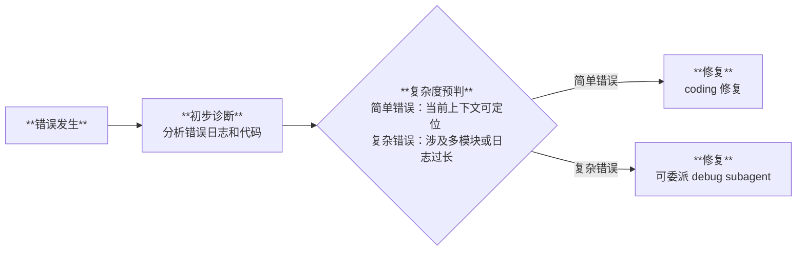

# 代码调试 Workflow

**适用场景**：运行错误、训练异常、性能问题等场景，需要修改已有代码以修复问题

---

## 流程图

---

## 阶段说明

| 阶段 | 关键动作 |
|------|----------|
| **初步诊断** | 分析错误日志、定位相关代码 |
| **复杂度预判** | 判断错误涉及范围，决定处理方式 |
| **修复** | 定位根因 + coding 修复 + 验证（复杂错误可委派 debug subagent） |

---

## 委派条件

**简单错误**（主 agent 自行修复）：
- 错误信息明确指向单一位置
- 根据当前上下文和相关文件即可定位根因
- 修复范围有限

**复杂错误**（委派 Debug subagent）：
- 涉及多个模块交互
- 日志过长需要全面调查
- 需要在临时分支中实验性修复

---

## 反馈与认知负担管理

**用户参与度**：低
- 用户只需提供错误信息/日志
- 修复过程尽量自动化
- 仅关键决策点请求确认，用通俗语言说明情况

**主阶段反馈**：以下时机需请求用户确认

| 时机 | 反馈内容 |
|------|----------|
| **开始前** | 确认进入调试流程，了解错误概况 |
| **初步诊断完成** | 汇报发现，确认问题理解是否正确 |
| **修复完成** | 汇报修复结果，请求验证确认 |

调用 `mcp_mcp-feedback-_interactive_feedback` 在反馈窗口汇报进展。仅遇到影响系统环境或重大决策时才在修复过程中请求额外反馈。