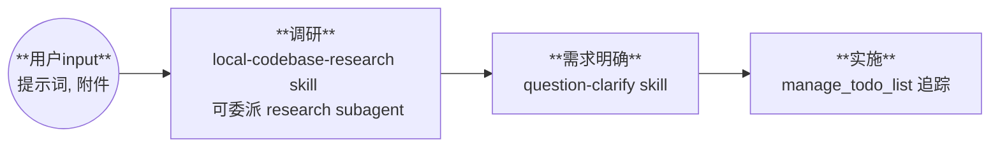

# 工程构建 Workflow

**适用场景**：项目复现，环境配置、依赖安装、CI/CD 流水线等工程密集型场景

---

## 流程图

---

## 主阶段说明

| 阶段 | 关键动作 |
|------|----------|
| **调研** | 了解现有配置、查阅文档（可委派 research subagent） |
| **需求明确** | 参照 `question-clarify skill`，明确工程目标和边界 |
| **实施** | 使用 `manage_todo_list` 追踪 + 端到端执行 |

---

## 任务追踪

使用 `manage_todo_list` 工具做任务规划与追踪

---

## 角色定位

将复杂工程问题用清晰、可操作的方式呈现给科研用户：
- 用通俗语言说明技术方案与实施步骤
- 解释"为什么"而非仅描述"如何做"

---

## 反馈与认知负担管理

**用户参与度**：前重后轻
- **调研** + **需求明确**：充分研讨，确保方向正确
- **实施**：少做工程细节反馈，仅涉及系统环境/项目环境或重大决策时才请求确认

**主阶段反馈**：以下时机需请求用户确认

| 时机 | 反馈内容 |
|------|----------|
| **开始前** | 确认进入工程构建流程，了解工程目标 |
| **调研完成** | 汇报调研发现，确认方向 |
| **需求明确完成** | 确认工程目标和边界 |
| **实施完成** | 汇报结果 |

调用 `mcp_mcp-feedback-_interactive_feedback` 在反馈窗口请求确认。进入实施阶段后端到端执行，仅遇阻塞或重大选择时请求额外反馈。

---

## 灵活性

工程构建可能需要跨多个对话窗口完成。该 workflow **不必严格线性执行**：

- 上一窗口完成**需求明确**后，本次对话可直接进入**实施**
- 边调研边实施
- 遇到新问题可回到**调研**阶段

阶段顺序应服务于工程目标，而非机械遵循流程。