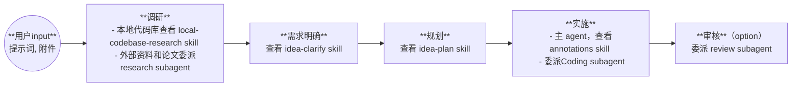

# 科研idea助理 Workflow

**适用场景**：用户提出科研想法，从抽象概念到具体实现的全流程支持

---

## 流程图

---

## 阶段说明

| 阶段 | 执行者 | 关键动作 |
|------|--------|----------|
| **调研** | 主 agent + research subagent | 本地代码库分析 + 外部文献调研 |
| **需求明确** | 主 agent | 参照 `idea-clarify skill`，收敛需求边界 |
| **规划** | 主 agent | 参照 `idea-plan skill`，创建/更新 `.plan` 文件体系 |
| **实施** | 主 agent 或 Coding subagent（用户指定） | 端到端 coding，少反馈 |
| **审核** | review subagent | 可选，风险与规范审查 |

### 实施阶段执行者选择

进入实施阶段前，询问用户偏好：

| 选项 | 适用场景 | 说明 |
|------|---------|------|
| **主 agent** | 简单任务、需要频繁交互、上下文已充足 | 直接在当前对话窗口编码 |
| **Coding subagent** | 复杂任务、边界明确、希望节省主窗口上下文 | 委派子 agent 独立完成，返回结构化结果 |

默认行为：**询问用户**，不自动假设。

---

## 反馈策略

每主阶段完成后，调用 `mcp_interactive_feedback` 在反馈窗口说明阶段进度，并请求批准是否进入下一阶段。

---

## 认知负担管理

用户参与度**前高后低**：
- **调研** + **需求明确**：充分交互，确保方向正确
- **规划** + **实施**：主 agent 端到端执行，仅遇影响科研结果的重大决策分支才请求反馈

---

## 灵活性

科研工作通常需要跨多个对话窗口承接完成，且根据实验效果可能需要迭代调整 idea。因此该 workflow **不必严格线性执行**：

- 上一窗口完成**规划**后，本次对话由于上下文缺失可回到**调研**
- 边调研边实施
- **需求明确**阶段根据讨论，可重返**调研**阶段

阶段顺序应服务于科研目标，根据用户提示和输入确认当前阶段和状态，而非机械遵循流程。

---

## 规划文件

`.plan` 文件体系是跨对话窗口的关键，可持续更新和参考的文档。创建、读取、更新和重构时应参照 `idea-plan skill`。
