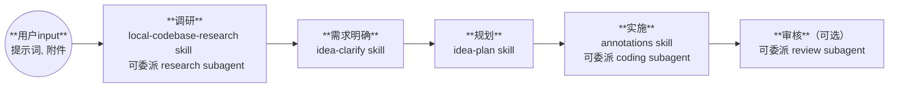

# 科研idea助理 Workflow

**适用场景**：用户提出科研想法，从抽象概念到具体实现的全流程支持

---

## 流程图

---

## 主阶段说明

| 阶段 | 关键动作 |
|------|----------|
| **调研** | 本地代码库分析（local-codebase-research skill）+ 外部文献调研（可委派 research subagent） |
| **需求明确** | 参照 `idea-clarify skill`，收敛需求边界 |
| **规划** | 参照 `idea-plan skill`，创建/更新 `.plan` 文件体系 |
| **实施** | 端到端 coding（可委派 coding subagent），参照 `annotations skill` |
| **审核**（可选） | 风险与规范审查（可委派 review subagent） |

---

## 反馈与认知负担管理

**用户参与度**：前高后低
- **调研** + **需求明确**：充分交互，确保方向正确
- **规划** + **实施**：端到端执行，仅遇影响科研结果或环境的重大决策分支才请求反馈

**主阶段反馈**：以下时机需请求用户确认

| 时机 | 反馈内容 |
|------|----------|
| **开始前** | 确认进入 idea 助理流程，了解用户初步想法 |
| **调研完成** | 汇报调研发现，确认方向 |
| **需求明确完成** | 确认需求边界，是否进入规划 |
| **规划完成** | 展示任务规划，确认是否开始实施 |
| **实施完成** | 汇报结果 |
| **审核完成**（可选） | 汇报审核发现 |

调用 `mcp_mcp-feedback-_interactive_feedback` 在反馈窗口说明阶段进度，请求批准进入下一阶段。

---

## 灵活性

科研工作通常需要跨多个对话窗口承接完成，且根据实验效果可能需要迭代调整 idea。因此该 workflow **不必严格线性执行**：

- 上一窗口完成**规划**后，本次对话由于上下文缺失可回到**调研**
- 边调研边实施
- **需求明确**阶段根据讨论，可重返**调研**阶段

阶段顺序应服务于科研目标，根据用户提示和输入确认当前阶段和状态，而非机械遵循流程。

---

## 规划文件

`.plan` 文件体系是跨对话窗口的关键，可持续更新和参考的文档。创建、读取、更新和重构时应参照 `idea-plan skill`。
