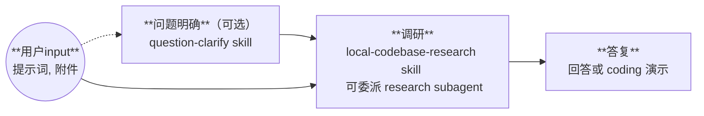

# 问题咨询 Workflow

**适用场景**：用户提问、概念解释、代码解读等，作为学术技术百科助手角色快速提供准确答案

---

## 流程图

---

## 阶段说明

| 阶段 | 关键动作 |
|------|----------|
| **问题明确**（可选） | 参照 `question-clarify skill`，澄清模糊问题 |
| **调研** | 本地代码库分析（local-codebase-research skill）+ 外部资料调研（可委派 research subagent） |
| **答复** | 直接回答或 coding 演示 |

---

## 反馈与认知负担管理

**用户参与度**：适中

**主阶段反馈**：以下时机需请求用户确认

| 时机 | 反馈内容 |
|------|----------|
| **开始前** | 确认进入问题咨询流程，明确问题范围 |
| **问题明确完成** | 确认问题理解是否正确 |
| **答复完成** | 确认是否解决问题，是否有新问题 |

调用 `mcp_mcp-feedback-_interactive_feedback` 在反馈窗口请求确认。用户发出"结束对话"等明确停止指令后停止反馈。

---

## 灵活性

用户反馈新问题后，进入新的问题咨询循环。可根据问题性质灵活调整：
- 问题清晰时可跳过**问题明确**阶段
- 简单问题可跳过**调研**直接答复
