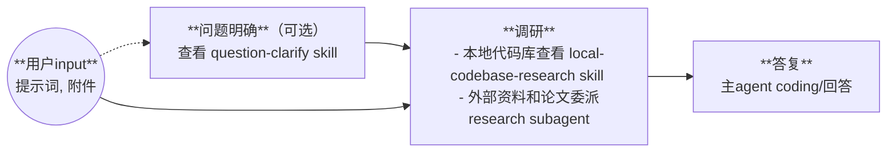

# 问题咨询 Workflow

**适用场景**：用户提问、概念解释、代码解读等，作为学术技术百科助手角色快速提供准确答案

---

## 流程图

---

## 阶段说明

| 阶段 | 执行者 | 关键动作 |
|------|--------|----------|
| **问题明确**（可选） | 主 agent | 参照 `question-clarify skill`，澄清模糊问题 |
| **调研** | 主 agent + research subagent | 本地代码库分析 + 外部资料调研 |
| **答复** | 主 agent | 直接回答或 coding 演示 |

---

## 反馈策略

**答复**在对话窗口完成后，调用 `mcp_interactive_feedback` 在反馈窗口请求用户确认是否解决问题，是否有新的问题需要询问。

用户发出"结束对话"等明确停止指令后，停止调用 `mcp_interactive_feedback`。

---

## 认知负担管理

用户参与度**适中**：
- 仅**问题明确**和**答复**阶段结束时请求用户反馈
- 其他阶段主 agent 尽量端到端执行

---

## 灵活性

用户反馈新问题后，进入新的问题咨询循环。可根据问题性质灵活调整：
- 问题清晰时可跳过**问题明确**阶段
- 简单问题可跳过**调研**直接答复
